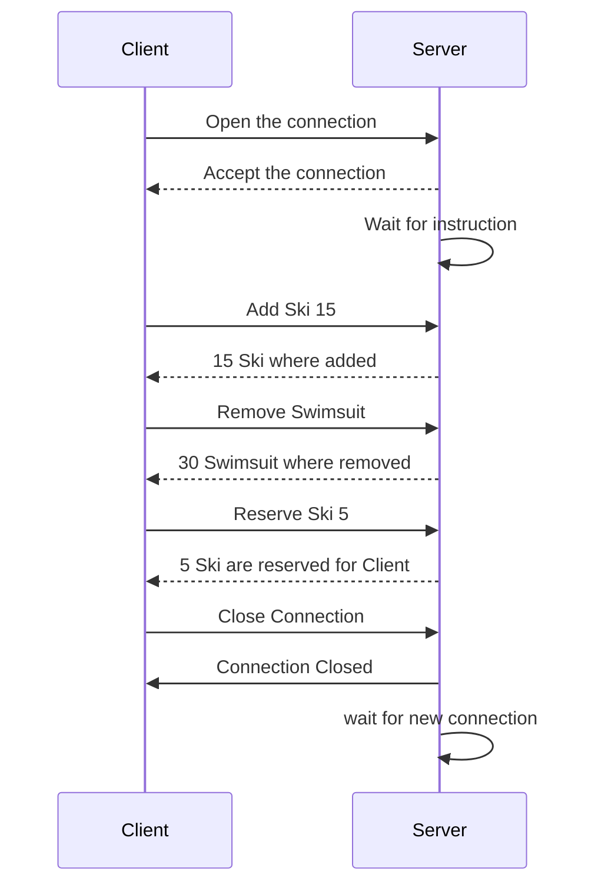
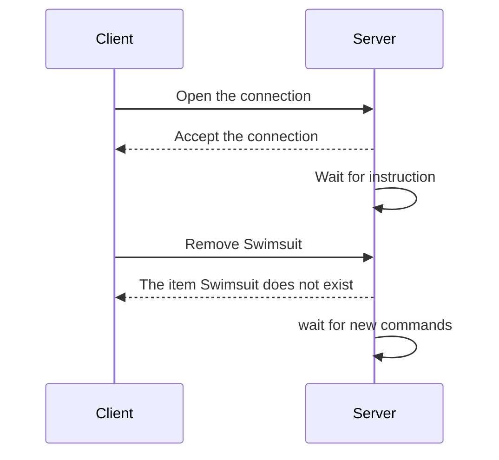
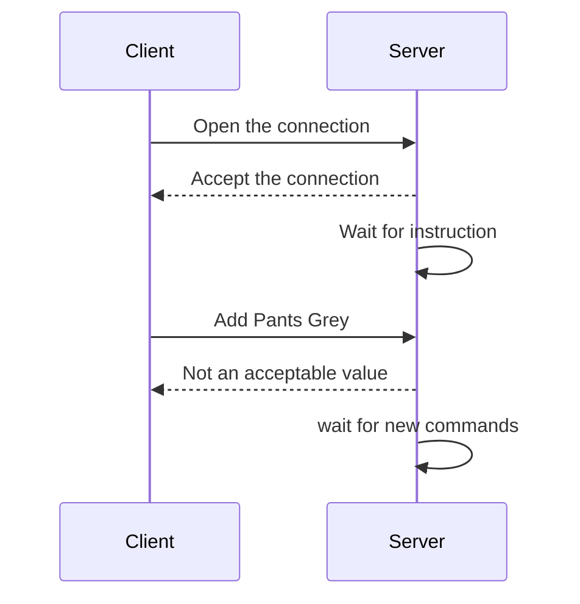

# DAI-2025-2026-Class-A-Practical-work-2-Sofia-Garfo-Henriques-Quentin-Eschmann-Thibault-Matthey
DAI-2025-2026-Class-A-Practical-work-2


## Protocol documentation
### Overview 

This protocol is used for communicating with the warehouse database. It is created to make the transaction in the inventory as fast and easy as possible.

### Transport protocol 

The protocol is used for any kind of communication with the inventory of the warehouse, he is set to be used on port 7580. <br>
Actions are stictly limited by the list of the commands given to you in the next part.<br>
The communication is made with REPL and the actions are treated and saved as text.<br>
The client has to initiate a connection with the server, the communication only start when the server has accepted the connection. <br>
If one of the instructions from the client is impossible or not following the expected format the server will respond with an error message. 


### Commands list 
Add [Item] [Name] [Number] - Add a new item with the [Name] and the [Number] indicated <br>
Remove [Item] - Remove the [Item] from the inventory<br>
List [Item]/All - List the number of [Item] available, or list every item in the inventory with the number<br>
Modify [Item] [NewName] - Rename the [Item] by the [NewName] <br>
Manage [Item] [NewNumber] - Change the number of [Item] available by the [NewNumber] <br>
Reserve [Item] [Number] - Reserve the [Number] of [Item] if possible, number of reserved items are shown by the "List" command.

### Usage Example

Basic usage example :



Trying to remove an unknown item :



Trying to add a wrong value of item :



## Arguments

To run this project, the arguments should be given like this : <br>
```bash
java -jar target/project3-1.0-SNAPSHOT.jar <PORT> [COMMAND] {--host <host>}
```
- \<PORT> references the port on wich the application will be run.
- [COMMAND] gives the information if we want to run a client or a server app. 
- {--host \<host>} is a client specific argument that specifies the server to wich connect.
