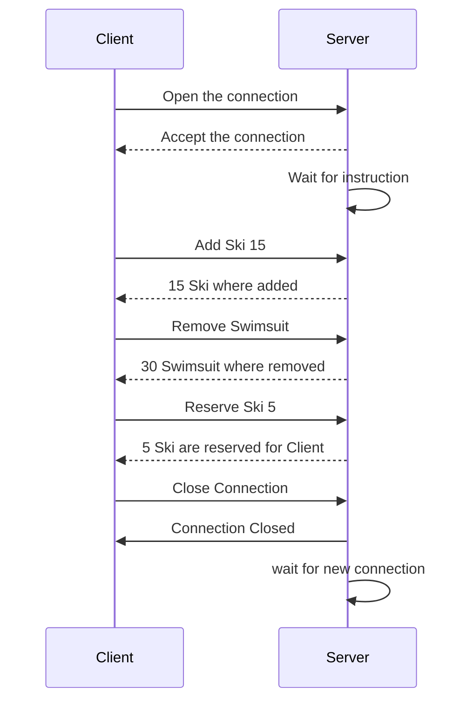
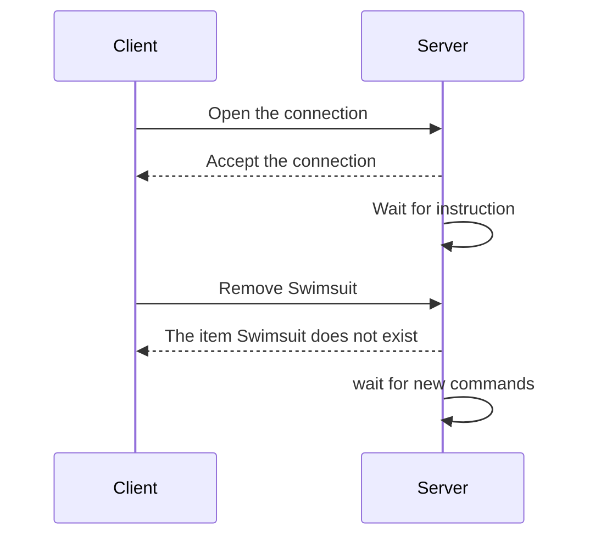
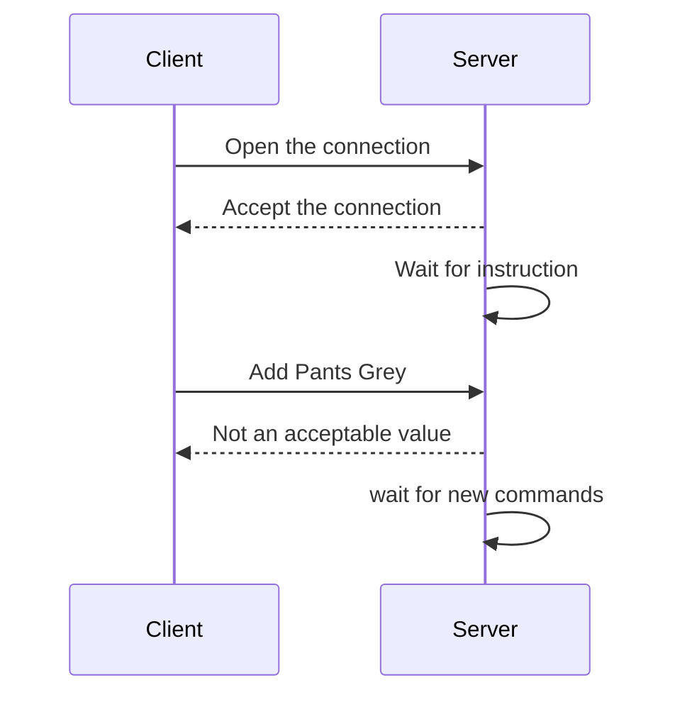

# DAI-2025-2026-Class-A-Practical-work-2-Sofia-Garfo-Henriques-Quentin-Eschmann-Thibault-Matthey
DAI-2025-2026-Class-A-Practical-work-2

This repository for the practical work 2 for the DAI course.

## Table of Contents

- [Project Description](#project-description)
- [Group Members](#group-members)
- [Installation and Usage](#installation-and-usage)
- [Protocol Documentation](#protocol-documentation)
    - [Overview](#overview)
    - [Transport Protocol](#transport-protocol)
    - [Commands List](#commands-list)
        - [Add Item](#add-item-number)
        - [Remove Item](#remove-item)
        - [List Item or All](#list-item-or-all)
        - [Modify Item ](#modify-item-newname)
        - [Manage Item ](#manage-item-newnumber)
        - [Reserve Item ](#reserve-item-number)
        - [Invalid Command](#invalid-command)
    - [Usage Example](#usage-example)
- [Contributing](#contributing)
- [Sources](#sources)

<br>

## Project description

A client-server inventory management system enabling multiple users to concurrently view and modify a shared warehouse database over a network.
The server maintains inventory data temporarily using ConcurrentHashMap structures for thread-safe, concurrent access.

This application could be a practical for solution for ephemeral inventory management at short-term events conferences, festivals, or pop-ups where data only last for the duration of said activity.

## Group Members

This project has been made by:
- Thibault Matthey
- Sofia Garfo Henriques
- Quentin Eschmann

## Installation and Usage

### Deploy using Docker:

This project is available via GitHub Container Registry. The only requirement is having Docker installed on your system.

To pull the image:
```bash
# Pull image from Container Registry 
docker pull ghcr.io/aihxpos111/warehouse:latest
```

To run the application:
```bash
# Create Network
docker docker network create mynet

# Open Server Connection
docker run --rm -it --name server --network=mynet -p 7580:7580 ghcr.io/aihxpos111/warehouse:latest Server

#Open Client Connection
docker run --rm -it --network=mynet ghcr.io/aihxpos111/warehouse:latest --host server Client
````

###  Building and Running Locally

To run the project locally clone this repository and use the following command in order to  build the project:

```bash
./mvnw clean package
```

To run this project locally, the arguments should be given like this : <br>
```bash
java -jar target/project3-1.0-SNAPSHOT.jar <PORT> [COMMAND] {--host <host>}
```
- \<PORT> references the port on which the application will be run.
- [COMMAND] gives the information if we want to run a client or a server app.
- {--host \<host>} is a client specific argument that specifies the server to which connect.


## Protocol documentation

### Overview 

This protocol is used for communicating with the warehouse database. It is created to make the transaction in the inventory as fast and easy as possible.

### Transport protocol 

The protocol is used for any kind of communication with the inventory of the warehouse, he is set to be used on port 7580. <br>
Actions are strictly limited by the list of the commands given to you in the next part.<br>
The communication is made with REPL and the actions are treated and saved as text.<br>
The client has to initiate a connection with the server, the communication only start when the server has accepted the connection. <br>
If one of the instructions from the client is impossible or not following the expected format the server will respond with an error message. 


### Commands list 

#### Add [Item] [Number] 

Add a new item with the [Name] and the [Number] indicated <br>
Answer : OK <br>
Error : INVALID Missing [item] parameter. Please try again. - Missing a parameters <br>
Error : INVALID item [Item] already exists in inventory - Item was already created

#### Remove [Item] 

Remove the [Item] from the inventory<br>
Answer : OK <br> 
Error : INVALID Missing [item] parameter. Please try again. - Missing a parameters<br>

#### List [Item] or All

List the number of [Item] available, or list every item in the inventory with the number<br>
Answer : the list desired or all the items. <br>
Error : INVALID the inventory is empty. - nothing is in the database to be displayed<br>
Error : INVALID item [Item] does not exist - the item you try to display does not exist in the database.

#### Modify [Item] [NewName]

Rename the [Item] by the [NewName] <br>
Answer : OK <br>
Error : INVALID Missing [oldname] or [newName] parameter. Please try again. - Missing a parameters<br>
Error : INVALID the Item [newName] already exist. - The new name already exists in the database.<br>
Error : INVALID the Item [oldName] does not exists. - The old name does not exist in the database. 

#### Manage [Item] [NewNumber]

Change the number of [Item] available by the [NewNumber] <br>
Answer : OK <br>
Error : INVALID Missing [Item] or [NewNumber] parameter. Please try again. - Missing a parameters.<br>
Error : INVALID [NewNumber] must be a positive integer or zero. - The new number is not a positive number.<br>
Error : INVALID [NewNumber] is not a valid integer. - The new number is not valid
 
#### Reserve [Item] [Number]

Reserve the [Number] of [Item] if possible, number of reserved items are shown by the "List" command.<br>
Answer : OK <br>
Error : INVALID Missing [Item] or [Number] parameter. Please try again. - Missing a parameters.<br>
Error : INVALID [Number] must be a positive integer or zero. - The number is not a positive number.<br>
Error : INVALID [Number] is not a valid integer. - The number is not valid.<br>
Error : INVALID [Number] is superior to actual stock. The number is superior to the ammount in the database.

#### Invalid Command 

Answer : INVALID Unknown command. Please try again.

### Usage Example

Basic usage example :


```mermaid
sequenceDiagram
    Client->>Server: Open the connection
    Server-->>Client: Accept the connection
    Server->>Server: Wait for instruction
    Client->>Server: Add Ski 15
    Server-->>Client: 15 Ski where added
    Client->>Server: Remove Swimsuit
    Server-->>Client: 30 Swimsuit where removed
    Client->>Server: Reserve Ski 5
    Server-->>Client: 5 Ski are reserved for Client
    Client->>Server: Close Connection
    Server->>Client: Connection Closed
    Server->>Server: wait for new connection


```

Trying to remove an unknown item :


```mermaid
sequenceDiagram
    Client->>Server: Open the connection
    Server-->>Client: Accept the connection
    Server->>Server: Wait for instruction
    Client->>Server: Remove Swimsuit
    Server-->>Client: The item Swimsuit does not exist
    Server->>Server: wait for new commands


```

Trying to add a wrong value of item :


```mermaid
sequenceDiagram
    Client->>Server: Open the connection
    Server-->>Client: Accept the connection
    Server->>Server: Wait for instruction
    Client->>Server: Add Pants Grey
    Server-->>Client: Not an acceptable value
    Server->>Server: wait for new commands


```
## Contributing

First, tag the image:

```bash
docker tag warehouse ghcr.io/<username>/warehouse:latest
```

Then , you'll need to log in to GitHub, we advise to do so using a personal access token , for more information please visit : [Working with the Container registry](https://docs.github.com/en/packages/working-with-a-github-packages-registry/working-with-the-container-registry)
```bash
docker login ghcr.io -u <username>
```

Now you can push your version to the GitHub Container Registry using the following command:
```bash
docker push ghcr.io/<username>/warehouse:lastest
```

## Sources

- GitHub Copilot : writing documentation
- [Oracle Documentation](https://docs.oracle.com/en/) : HashMap implementation.
- [GeeksforGeeks](https://www.geeksforgeeks.org) : HashMap implementation and code examples.
- [StackOverflow](https://stackoverflow.com) : Docker utilisation and code examples.
- [Docker Docs](https://docs.docker.com/) : Docker utilisation
- [DAI Course](https://github.com/heig-vd-dai-course/heig-vd-dai-course) : Code Examples and course material.
